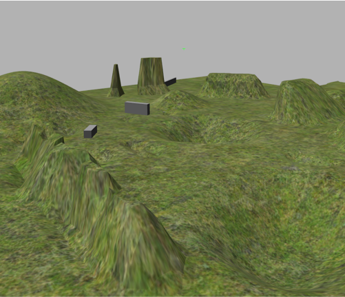
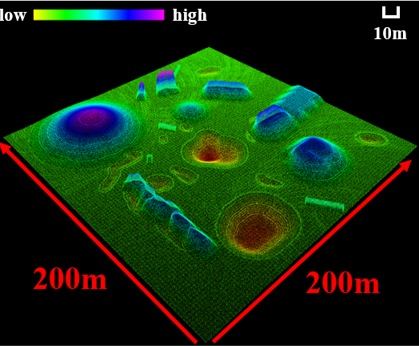
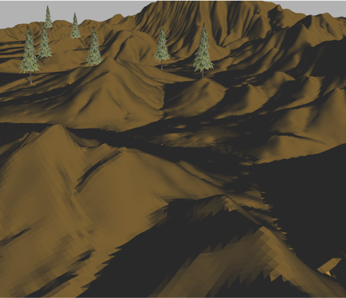
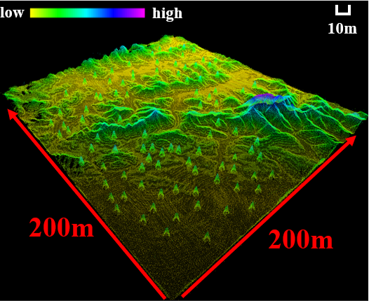
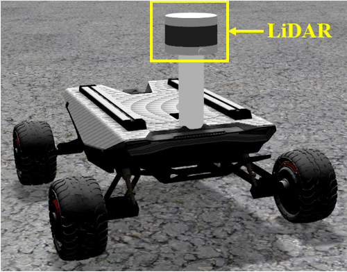
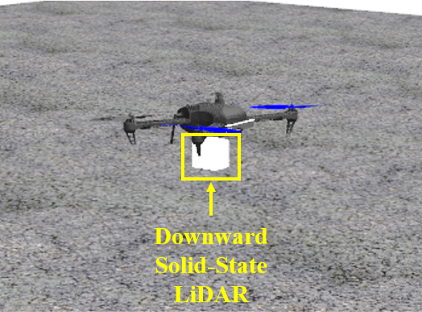
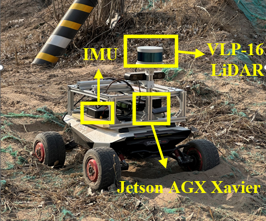
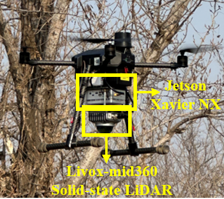

# Risk-inspired Aerial-ground Collaborative Path Finding in Unknown Off-road Environments

# System Overview

# Simulation Experiments
## Simulation Setup
(1) Terrain models

The normal terrain model was manually designed by using terrain generator software. The complex terrain model was generated by remote sensing terrain data.

  
  
  
  

(2) Robot models

The UAV model was an open-source model called iris and was equppied with a downward solid-state LiDAR called Livox-Mid360. The UGV model was SCOUT MINI which was produced by AGILE·X and carried a VLP-16 LiDAR with 0.1m∼30m measurement range and 10Hz data frequency

  
  

## Some Demos
(1) Task1

  
  
  

(2) Task2

  
  
  

# Real-world Experiments
## Hardware Setup
The UAV was equipped with a NVIDIA Jetson Xavier NX and a downward Livox-mid360 solid-state LiDAR. The data rate of the LiDAR was set to 10Hz for aerial terrain risk mapping. The UGV was equipped with the NVIDIA Jetson AGX Xavier, a 3D Velodyne-16 LiDAR with 10 Hz and an IMU with 400Hz measurements. Long range Wi-Fi was applied to establish the communication between the robots. 

  
  

## Real-world Test

  

  

